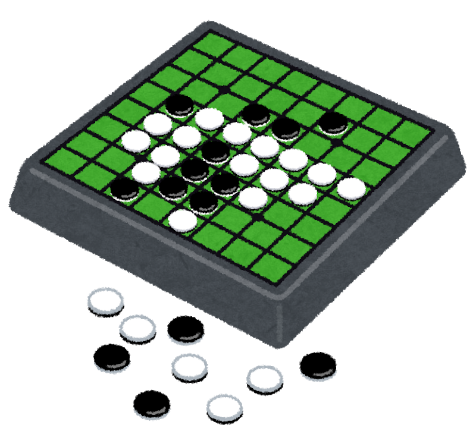

# 
Othello

<i>Othello is a board game invented in 1973 in Japan. The name of the game was 
inspired by William Shakespears story of "Othello". </i>

<b>Development Team:</b> 

 Hunter Dutton 
 Tyler Hickey  
 Luis Javier Moreno Pérez  
 Jonathan Thomas  

## Description:
This is an implementation of Othello in Python using the pyGames framework. 

For the AI version of the game, the minimax algortihm was implemented. This algorithm is a recursive algorithm that searches the game tree to determine the best move. It works by assuming that the opponent will make the move that is worst for the current player and choosing the move that is best for this player. The algorithm evaluates each possible move by simulating the game to a certain depth and assigning a score to each resulting board position. The move that leads to the highest-scoring board position is chosen. 

In addition, we implemented an optimization of the minimax algorithm that reduces the number of nodes that need to be evaluated by cutting off parts of the tree that are unlikely to lead to a better solution. This algorithm works by keeping track of two values: alpha, which is the best score found so far for the maximizing player, and beta, which is the best score found so far for the minimizing player. If a node is found that leads to a score worse than alpha or better than beta, the algorithm can stop evaluating that branch of the tree because it knows that it will not affect the final result.

## Libaries required:
copy  
pygame

## How to run:
Run main.py to play. 

###  Human vs AI:

Play against an intelligent AI that will place a piece according to an algorithm made by Luis Javier Moreno Perez.

### Human vs Human:

Play against your friend!

## How to Play:

Othello, also known as Reversi, is a two-player strategy board game played on an 8x8 board with discs that are black on one side and white on the other. Here are the basic rules:

At the beginning of the game, four discs are placed in the center of the board: two black and two white, with the black discs forming a diagonal line.

The players take turns placing their discs on the board. Each disc must be placed adjacent to an opponent's disc in such a way that it "sandwiches" one or more of the opponent's discs between two of the player's own discs.

All the sandwiched discs are flipped over to the player's color. For example, if a black disc is placed next to a white disc, and there is another black disc on the other side of the white disc, the white disc is flipped over and becomes black.

If a player cannot make a legal move, they must pass their turn.

The game ends when the board is completely filled with discs, or when both players pass their turn. The player with the most discs of their color on the board at the end of the game wins.

Othello is a game that requires strategic thinking and careful planning, as players must consider the potential consequences of each move they make.
Therefore, it is a simple game to learn but requires strategic thinking to master. Good luck!

## Detailed rules:
You can find all the rules of Othello at the link below:
https://www.worldothello.org/about/about-othello/othello-rules/official-rules/english

Best of luck!

